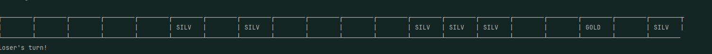
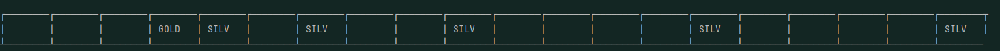
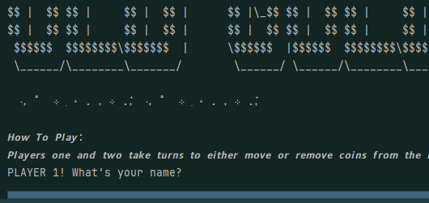
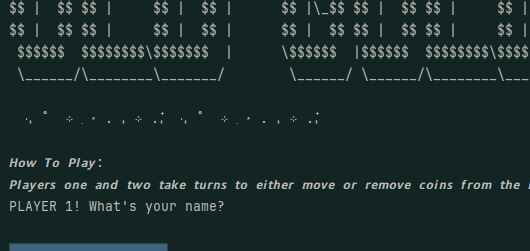
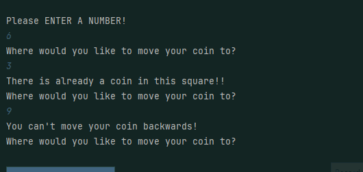
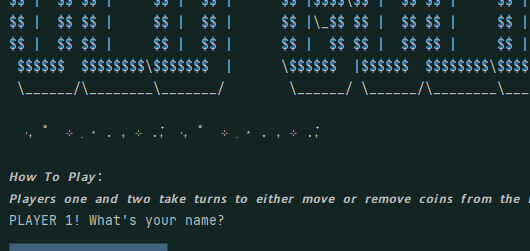
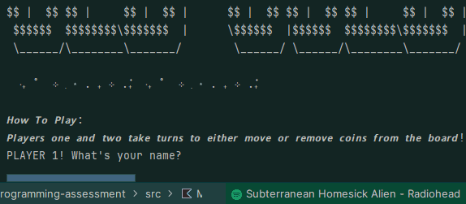
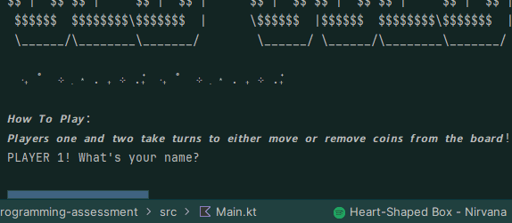
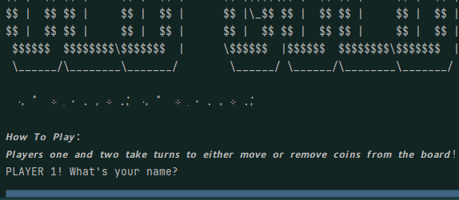

# Results of Testing

The test results show the actual outcome of the testing, following the [Test Plan](test-plan.md)

---

## The coins get added to the board
A random number of silver coins (slightly more or slightly less than five) and 1 gold coin should get added to the board.

****

### Test Data Used

I will run the game multiple times to check if the coins get added.

### Test Result

The first time, six silver coins got added to the board, and one gold coin. 

The second time, six silver coins got added to the board, and one gold coin.

The third time, only 5 silver coins were added, and one gold coin. 

Each time, the coins get added to the board. 

---

## Boundry testing the moved coins

If the user tries to pick a square outside the board for a coin to move, the game should inform them that the move is invalid. 

### Test Data Used

I will run the program, and when it asks to pick a coin, enter 21, -1, and 0. 

### Test Result

The program returns 'Please pick a square to move!' 

---

## Invalid testing, if a player picks a square with a coin that isn't there

Testing to check that, when the user is prompted to pick a coin, if they choose to select a square without a coin as the coin they want to move, the program returns an appropritae error.  
### Test Data Used

I ran the program, and picked squares without coins. 
### Test Result

When I ran the program, it returned 'please choose a coin!' instead of crashing, and then loops to get another number. I then entered a valid input, and it asked where I wanted to move it. 

---
## Invalid testing if the user wants to move their coin to a full square

If when prompted, the user opts to move their coin to a square that already has a coin in it
### Test Data Used

I ran the program multiple times, each time selecting to move my coin to a square that already has a coin in it.
### Test Result

When I attempted to move my coin, which was at six, The program returned "there is already a coin in this square!" Instead of crashing.

---

## Invalid - if the user puts something random in for their prompt

If, when prompted to move a coin or select a coin to move, the user puts letter, or some other invalid character type it.

### Test Data Used

When prompted to select a coin to move, I put a random string of letters instead of an int. Then, when prompted again on where tp move my coin to, I put another random string of characters.
### Test Result

When I first tried this, it did work as intended, but instead said 'please choose a coin' instead of 'please choose a square'. After I fixed this, the program worked fine. 

---

## Valid Testing for Coin Moves

I'm testing to see if, when prompted, if the user selects to move a valid coin, to a valid place, the coin moves.

### Test Data Used

I ran the program, and when prompted, I selected a valid coin to move, and a valid coin-moving square. 

### Test Result

When I selected a valid square, and a valid coin, the program moved it.

---

## Valid Testing player moves

Testing to make sure that until the game ends, it correctly shows who's turn it is. 
### Test Data Used

I will run the program, and play the game, drawing it out as long as possible , as to make sure the game always gets it right.

### Test Result

Each player is asked to take a turn, one after each other. 

---

## Invalid - Players can enter numbers as their name.

If the user inputs a number or a space as their name, the program accepts it as the name they want, and doesn't crash.

### Test Data Used

I ran the program, and put different things such as numbers or empty characters as my player name. 

### Test Result

The program treated the spaces and number as if they were names. I originally had a condition that didn't let you have spaces, but decided that players may not want to have their names for privacy reasons. 

---

## Valid - long names

PLayer inputs a really, really, long player name.

### Test Data Used

I ran the program and put in a really long player name.
 
### Test Result

My program can comfortably cope with very long player names. 

---

## Invalid - if the user tries to move their coin backwards

If, when prompted the user tries to move their coin backwards, the program should inform them they can't do that.

### Test Data Used

I ran the program and, when prompted, tried tom ove my coin backwards on the board
### Test Result

The program informed the user that they couldn't move their coin backwards. 

---

